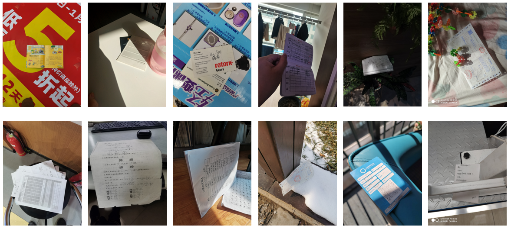
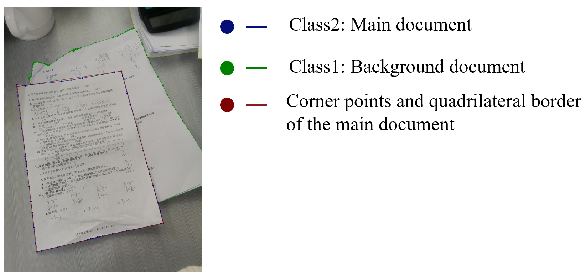

# RWMD_dataset
The **Real-world Mobile Document (RWMD)** Dataset for the research of real-world document localization is now released by Institute of Multimedia Knowledge Fusion and Engineering, Xi’an Jiaotong University. The dataset can be downloaded through the following link:  
 
•	Baidu Cloud:https://pan.baidu.com/s/1QTwiUXq4ITHPzAX91f9YDA (Size=3.98G)  
•	OneDrive: (Will be available soon)  
 
**Note**: The RWMD dataset can only be used for non-commercial research purpose. For scholars or organization who wants to use the RWMD dataset, please first fill in this Application Form [Download Application Document](https://github.com/ScholarlyShare/RWMD_dataset/blob/main/Application_Form_for_Using_RWMD_dataset_2024.docx) and send it via email to us (xjtufy@stu.xjtu.edu.cn). When submiting the application form to us, please list or attached 1-2 of your publications in recent 6 years to indicate that you (or your team) do research in the related research fields of OCR, document analysis and recognition, document image processing, and so on. We will give you the download and decompression passwords after your letter has been received and approved.

## Description
The images in RWMD dataset are captured by eight different mobile phones including iPhone13, Samsung Galaxy S21 Ultra, HUAWEI nova 7 SE, HUAWEI P30, HUAWEI P50 Pro, VIVO S17e, VIVO X21A, and Xiaomi 8. The RWMD dataset contains a total of 2009 images which are divided into nine categories. Moreover, each category contains documents in different styles with different real background, distortion, rotation, perspective transformation, high contrast, light intensity, occlusion and other real situations. The following are some samples of different types of documents with various scenarios: 
 

 
In order to meet the needs of different methods, the RWMD annotation documents contain a variety of information, including masks of different document areas, class labels of different document instances corresponding to the masks, and corner points coordinates of the document. If the image contains multiple different documents, in order to be closer to the actual usage scenarios of the document localization algorithms on the devices, we distinguish the main document and the background document based on the area size and position of different documents in the image. As presented in following figure, different document areas are marked separately, the main document is given the maximum class label value 2 and the corner points coordinates are also marked. 
 

 
The reference data preprocessing code is provided in the python file data_preprocessing_rwdm_1.py 
 
## Citation and Contact
Please consider to cite our paper when you use our dataset: 
 
Yaqiang Wu, Zhen Xu, Yong Duan, Yanlai Wu, Qinghua Zheng, Hui Li, Xiaochen Hu, and Lianwen Jin. 2024. RDLNet: A Novel and Accurate Real-world Document Localization Method. In Proceedings of the 32nd ACM International Conference on Multimedia (MM ’24), October 28-November 1, 2024, Melbourne, VIC, Australia. ACM, New York, NY, USA, 9 pages. https://doi.org/10.1145/3664647.3681655  
 
For any questions about the dataset please contact the authors by sending email to xjtufy@stu.xjtu.edu.cn. 
 
## Statement
Many documents in the images of RWDM dataset are public or internal publications, we do not own the copyright of these documents. For researchers and developers who wish to use the images for non-commercial research and/or education purpose, we provide the access to images and the corresponding annotations. 

If you believe that any images or contents in RWMD dataset violated your rights, please let us know, and we will remove the images.

